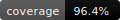

# CICD-TextStats
CI/CD-ready Python CLI that computes text statistics and showcases engineering best practices.

**Purpose:** To showcase clean repo practices + CI/CD (lint, type-checks, tests, coverage) with GitHub Actions.

